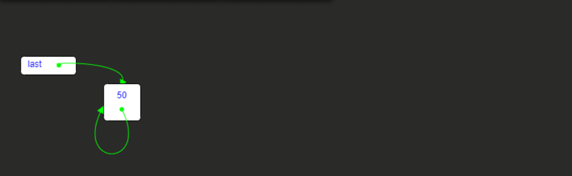
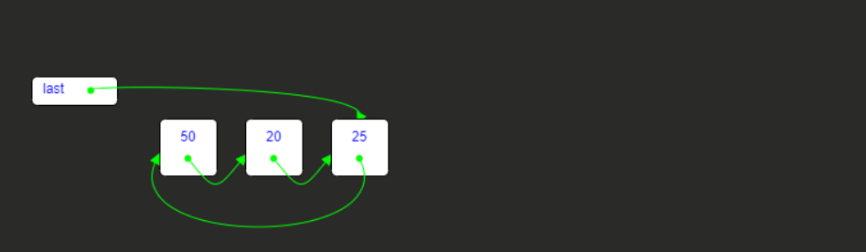

<h2>Circular Linked List</h2>
<h3>What is a Circular Linked List?</h3>

<pre>A circular linked list is a data structure where data is arranged in interconnected loops or rings.  
Each loop represents a data element, and the last element is connected to the first element to form a circular list.</pre>
<pre>

Circular linked lists can be used in various programming problems.
 For example, they can be used to implement a stack with various data structures. 
 Additionally, they can be used when data needs to be processed in a circular manner

</pre>
<pre>

Circular linked lists are a type of linked list structure, and the links between elements are particularly important for memory management. 
Lists provide a mor flexible management of memory resources.

</pre>

Therefore, I have implemented operations for <pre>adding a number to a circular linked list,</pre>
<pre>Removing a number a from it,</pre>
<pre>Searching for a number in it,</pre>
<pre>and displaying the list</pre>
in this project.

<h4>For example, let's step-by-step add the numbers '50,20,25,30,18,29,36,63' to our list.</h4>
<pre>

</pre>

You can share your thoughts through my social media accounts listed on my profile. Have a good day! 👋

